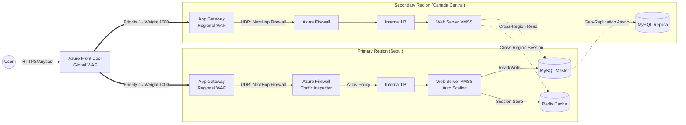

# Enterprise-Grade Azure DR Architecture
> **프로젝트 목표:** 비즈니스 연속성(BCP) 보장 및 고가용성(HA)을 위한 다중 리전(Multi-Region) 인프라 구축


## 1. 프로젝트 개요
단순 웹 호스팅을 넘어 엔터프라이즈 환경에서 요구하는 재해 복구(DR) 시스템을 IaC(Terraform)로 구현함.
Azure Front Door를 통해 주 리전(Primary)과 재해 복구 리전(Secondary)으로 트래픽을 동시 분산하는 **Active-Active** 아키텍처를 채택함. (단, DB는 정합성을 위해 Active-Standby 유지) 
허브-스포크(Hub-Spoke) 네트워크 구조를 기반으로 모든 내/외부 트래픽을 중앙에서 통제하는 심층 방어 전략(Zero Trust)을 적용함.

---

## 2. 아키텍처 구성도
Azure Front Door가 글로벌 진입점 역할을 하며, 양쪽 리전으로 트래픽을 분산함. 리전 내부로 들어온 트래픽은 웹 방화벽(WAF)과 중앙 방화벽(Azure Firewall)을 모두 거쳐야만 애플리케이션에 도달함.



---

## 3. 핵심 기술 및 구현 논리

* **Active-Active 웹 트래픽 분산**
    * Front Door의 Origin 그룹을 동일한 우선순위(Priority 1)와 가중치로 설정하여 양쪽 리전의 VM Scale Set을 100% 활용함.
* **사용자 세션 유지 (Stateless Architecture)**
    * `cloud-init` 스크립트를 통해 PHP 세션 저장소를 로컬 디스크가 아닌 Primary 리전의 Redis로 지정함.
    * Active-Active 환경에서 어느 리전의 웹 서버로 접속하든 동일한 Redis를 바라보도록 설정하여 세션 불일치 및 재로그인 방지.
* **다중 리전 데이터베이스 복제 (Active-Standby)**
    * 웹/앱 계층은 Active-Active로 동작하되, MySQL은 데이터 정합성을 위해 Master-Read Replica 구조로 구성.
* **제로 트러스트 네트워크 (Hub-Spoke)**
    * 웹 방화벽(App Gateway)을 통과한 트래픽이라도 내부망 진입 시 Azure Firewall을 경유하도록 강제(UDR 적용).
    * DB 및 Redis는 공인 IP를 원천 차단하고 Private Endpoint로만 접근 허용.
* **불변 인프라 및 자동화 (Immutable & Auto-Scaling)**
    * CPU 사용량 기준(80% 초과 시 증설, 30% 미만 시 축소) 오토스케일링 정책 코드로 정의.

---

## 4. 기술 스택

| 분류 | 기술 스택 | 적용 목적 및 활용 |
|:---:|:---|:---|
| **IaC** |  | Policy, Hub, App, Data, DMZ 등 모듈 기반 인프라 프로비저닝 |
| **Global LB** |  | 글로벌 트래픽 Active-Active 라우팅 및 1차 WAF 방어 |
| **Regional LB** |  | SSL 처리, 경로 기반 라우팅, 2차 WAF (OWASP 3.2) |
| **Compute** |   | Rocky Linux 기반 웹 서버 클러스터링 및 오토스케일링 |
| **Database** |  | 데이터 정합성 보장 및 리전 간 비동기 복제 |
| **Cache** |  | 중앙 집중형 세션 스토어 |
| **Security** |   | 중앙 트래픽 제어, FQDN 필터링 및 시크릿(DB 패스워드, SSH) 자동 관리 |

---

## 5. 설계 의도 (Architecture Design Intent)

* **프론트엔드 Active-Active / 백엔드 Active-Passive 분리 구성**
    * 인프라 활용도를 극대화하기 위해 웹 계층은 Front Door를 통해 Active-Active로 로드밸런싱함. 반면, 데이터베이스는 양방향 동기화 시 발생하는 지연(Latency)과 충돌을 방지하기 위해 단방향(Master-Replica) 구조를 채택하여 성능과 안정성의 균형을 맞춤.
* **트래픽 2단계 전수 검사 로직**
    * 웹 서버 앞단의 트래픽뿐만 아니라, 웹 서버와 DB 간의 내부 통신까지 모두 방화벽을 경유하도록 설계함. 이를 통해 WAF를 우회하는 공격이나 내부망 확산 시도를 중앙 방화벽 로그에서 모두 탐지 가능하도록 구성함.
* **Key Vault 연동을 통한 시크릿 관리 자동화**
    * 보안을 위해 DB 암호나 SSH 키를 코드에 하드코딩하지 않음. Terraform 배포 시점에 무작위 암호를 자동 생성하고, 즉시 Azure Key Vault에 저장하도록 파이프라인을 구축함.

---

## 6. Technical Challenges & Troubleshooting

**① 로드밸런서 계층 구조에 따른 HTTP/HTTPS 프로토콜 불일치 해결**
* **문제:** 글로벌 라우팅(Front Door)과 지역 로드밸런서(App Gateway)에서 HTTPS 트래픽을 수신하고, 내부 VMSS(Web Server)로는 HTTP(80) 포트로 패킷을 전달하도록 구성함. 이로 인해 워드프레스 애플리케이션이 자신에게 도달한 트래픽을 HTTP로 인식하여, 보안 연결 강제 과정에서 무한 리디렉션(500 에러) 및 Mixed Content 오류 발생.
* **해결:** VM 인스턴스 프로비저닝 시 실행되는 구동 스크립트(`web_init.yaml`)에 PHP 코드를 동적으로 주입함. `wp-config.php` 파일에 `$_SERVER['HTTPS'] = 'on'` 값을 강제하고, 도메인 URL을 환경 변수로 주입하는 쉘 스크립트를 삽입하여 애플리케이션 단의 프로토콜 인식 오류를 원천 차단함.

**② 구독 할당량(Quota) 제한에 따른 Azure MySQL Flexible Server 리전 우회**
* **문제:** 데이터베이스의 Zone Redundant(액티브-스탠바이) 및 읽기 전용 복제본(DR) 구성을 위해서는 MySQL Flexible Server의 General Purpose 이상 티어가 필수적임. 그러나 부여된 구독의 할당량 제한 및 아시아 리전(Korea South, Japan 등)의 하드웨어 가용성 부족으로 리소스 배포 불가 현상 발생.
* **해결:** IaaS 기반의 직접 VM 구축으로 선회할지 고민했으나, PaaS가 제공하는 자동 백업 및 이중화 이점을 포기할 수 없다고 판단함. 리전별 가용성을 반복 테스트하여 제약이 없는 `Canada Central` 리전을 DR(Secondary) 목적지로 최종 선정하고 전체 아키텍처를 재설계함.

**③ Terraform 암시적 의존성 구조화를 통한 배포 시간 단축 (60분 -> 25분)**
* **문제:** 인프라 코드 초안 작성 시, 모듈 간 선후 관계를 강제하기 위해 명시적 `depends_on` 블록을 과도하게 사용함. 이로 인해 AzureRM Provider가 리소스를 직렬로 프로비저닝하여 전체 배포에 최대 1시간이 소요됨.
* **해결:** 모듈 간의 상태 참조를 분석하여 명시적 의존성을 최소화함. `module.policy.log_analytics_id` 와 같이 출력 변수(Output)를 입력 변수로 받아들이는 암시적 의존성(Implicit Dependency) 구조로 리팩토링함. 논리적 연관성이 없는 리소스들이 병렬 배포되면서 프로비저닝 시간을 25~40분 수준으로 단축함.

**④ 글로벌 고유 명명 규칙에 의한 PaaS 리소스 충돌 방지**
* **문제:** Key Vault, Log Analytics Workspace 등의 PaaS 리소스는 Azure 글로벌 환경에서 고유한 이름을 가져야 함. 잦은 인프라 배포/파괴 과정에서 Soft-Delete 된 이전 리소스와 이름 충돌 에러가 지속 발생함.
* **해결:** Terraform의 `random_string` 리소스를 도입함. 각 PaaS 리소스 이름 접미사에 동적 난수 리소스를 주입하여 배포 시마다 고유성을 보장하고 프로비저닝 멱등성을 확보함.

**⑤ WAF 계층 분리 및 Redis 티어 조정을 통한 비용 최적화**
* **문제:** Front Door Premium 티어의 사전 정의 WAF 규칙은 관리가 용이하나 비용이 과도함. Redis Cache 또한 Geo-Replication 기능을 사용하려면 고가의 Premium 티어가 강제되어 오버엔지니어링 우려 존재.
* **해결:** Front Door는 Standard 티어로 글로벌 라우팅에만 집중시키고, 지역 내 Application Gateway에 WAF_v2 SKU(OWASP 3.2 룰셋)를 결합하여 비용을 방어함. Redis는 DR 전환 시 일시적인 캐시 미스를 허용하는 타협안을 도출, 주 리전에만 Standard 티어 기반으로 단일 구축하는 경제적 아키텍처를 적용함.

---

## 7. 배포 가이드 (Deployment Procedure)

### Prerequisites
* Terraform v1.5+
* Azure CLI (Authenticated)
* Azure Subscription ID

### Execution Steps
1. **Initialize Terraform**
    ```bash
    terraform init
    ```
2. **Review Execution Plan**
    ```bash
    terraform plan -var="subscription_id=<YOUR-SUBSCRIPTION-ID>"
    ```
3. **Provision Infrastructure**
    ```bash
    terraform apply -auto-approve -var="subscription_id=<YOUR-SUBSCRIPTION-ID>"
    ```
4. **Validation**
    * Output에 출력된 `GLOBAL_SERVICE_INFO.service_domain` 주소로 접속하여 상태 확인.
    * 생성된 서버 SSH 키와 DB 암호는 Azure Portal의 Key Vault 내 Secrets에서 확인 가능.
