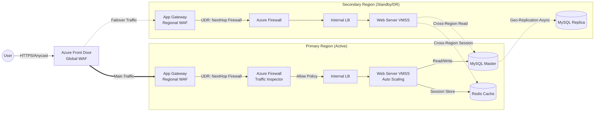

# 🌍 Enterprise-Grade Azure DR Architecture
> **프로젝트 목표:** 비즈니스 연속성(BCP) 보장 및 고가용성(HA)을 위한 다중 리전(Multi-Region) 인프라 구축


## 1. 프로젝트 개요
단순 웹 호스팅을 넘어 엔터프라이즈 환경에서 요구하는 재해 복구(DR) 시스템을 IaC(Terraform)로 구현함.

물리적으로 격리된 주 리전(Primary)과 재해 복구 리전(Secondary)을 활용하여 리전 전체 장애 시 서비스 지속성을 보장하며, 허브-스포크(Hub-Spoke) 네트워크 구조를 기반으로 모든 내/외부 트래픽을 중앙에서 통제하는 심층 방어 전략을 적용함.

---

## 2. 아키텍처 구성도

Azure Front Door를 글로벌 진입점으로 사용하며, 리전 내부로 들어온 트래픽은 웹 방화벽(WAF)과 중앙 방화벽(Azure Firewall)을 모두 거쳐야만 애플리케이션에 도달하는 구조.



---

## 3. 핵심 기술 및 구현 논리

### 1. 다중 리전 재해 복구 (Multi-Region DR)
* **데이터 정합성 보장**
    * 주 리전은 Master, DR 리전은 Read Replica로 구성하여 실시간 데이터 복제 환경 구축.
    * Terraform 모듈(`03_data` vs `07_data`)을 분리하여 리전별 역할을 코드 레벨에서 명확히 정의함.
* **사용자 세션 유지 (Stateless)**
    * `cloud-init` 스크립트를 통해 PHP 세션 저장소를 로컬 디스크가 아닌 Redis로 변경.
    * DR 리전의 웹 서버도 주 리전의 Redis를 바라보도록 설정하여, 트래픽 절체(Failover) 시 재로그인 불필요.

### 2. 제로 트러스트 네트워크 (Hub-Spoke)
* **2단계 트래픽 전수 검사**
    * 웹 방화벽(App Gateway)을 통과한 트래픽이라도 내부망 진입 시 Azure Firewall을 경유하도록 강제(UDR 적용).
    * 경계망(DMZ)조차 신뢰하지 않는 보안 원칙 구현.
* **접근 격리**
    * DB 및 Redis는 공인 IP(Public IP)를 원천 차단하고 Private Endpoint로만 접근 허용.
    * 관리자용 Bastion Host 또한 특정 IP 대역에서만 접근 가능하도록 제한.

### 3. 자동화 및 확장성
* **오토스케일링 (Auto-Scaling)**
    * CPU 사용량 80% 초과 시 증설, 30% 미만 시 축소 정책을 코드로 정의하여 비용 효율성 확보.
* **불변 인프라 (Immutable Infrastructure)**
    * `web_init.yaml`을 활용해 서버 부팅 시점에 OS 설정 및 애플리케이션 배포를 100% 자동화.

---

## 4. 기술 스택

| 구분 | 기술 스택 | 활용 내용 |
|:---:|:---|:---|
| **IaC** | Terraform | 모듈 기반 인프라 배포 (Policy, Hub, App, Data, DMZ) |
| **Global LB** | Azure Front Door | 글로벌 트래픽 라우팅 및 1차 WAF 방어 |
| **Regional LB** | App Gateway | SSL 처리, 경로 기반 라우팅, 2차 WAF (OWASP 3.2) |
| **Compute** | VM Scale Set | Rocky Linux 9 기반 웹 서버 클러스터링 |
| **Database** | MySQL Flexible | 고가용성(HA) 및 리전 간 복제 구성 |
| **Security** | Azure Firewall | 중앙 집중형 트래픽 제어 및 가시성 확보 |
| **Monitoring** | Sentinel / AMA | 통합 로그 수집 및 보안 위협 탐지 |

---

## 5. 트러블슈팅 및 설계 의도

### Q1. 트래픽이 방화벽을 총 4회 통과하는 이유는?
> **설계 의도: 성능보다 보안 가시성 우선**
> 웹 서버 앞단의 트래픽뿐만 아니라, 웹 서버와 DB 간의 내부 통신까지 모두 방화벽을 경유하도록 설계함. 이를 통해 WAF를 우회하는 공격이나 내부망 확산 시도를 중앙 방화벽 로그에서 모두 탐지 가능함.

### Q2. Redis를 리전별로 두지 않고 단일 구성한 이유는?
> **설계 의도: 비용 효율성을 고려한 Active-Passive 전략**
> 엔터프라이즈급 Redis(Geo-Replication) 비용 절감을 위해 스탠다드 단일 구성을 채택함. 실제 운영 시에는 지연(Latency)이 적은 인접 리전을 사용하겠지만, 본 프로젝트는 구독 제약으로 캐나다 리전을 사용함. 주 리전 파괴 시 세션 정보 유실(재로그인)을 허용하더라도 인프라 비용을 낮추는 RPO Trade-off 선택.

### Q3. 외부 저장소(Github 등)의 유동 IP 처리는?
> **해결 방법: Azure Firewall FQDN 태그 활용**
> 외부 패키지 저장소의 IP가 수시로 변경되므로 일반적인 IP 차단 규칙으로는 관리 불가. `*.rockylinux.org`, `github.com` 등 도메인 주소(FQDN) 기반의 애플리케이션 규칙을 적용하여 안정적인 업데이트 환경 보장.

### Q4. 배포 시 DB 암호 관리 방안은?
> **구현 방법: Key Vault 자동 생성 및 연동**
> 보안을 위해 DB 암호나 SSH 키를 코드에 명시하지 않음. Terraform 배포 시점에 무작위 암호를 자동 생성하여 즉시 Azure Key Vault에 저장하도록 구현함.

---

## 6. 배포 가이드

### 사전 준비
* Terraform v1.5 이상
* Azure CLI (로그인 완료 상태)
* 유효한 Azure 구독 ID (Subscription ID)

### 배포 순서
1.  **초기화 (Init)**
    ```bash
    terraform init
    ```
2.  **계획 확인 (Plan)**
    * `subscription_id`는 필수 값이므로 직접 입력하거나 변수 파일에 지정.
    ```bash
    terraform plan -var="subscription_id=xxxxxxxx-xxxx-xxxx-xxxx-xxxxxxxxxxxx"
    ```
3.  **인프라 배포 (Apply)**
    ```bash
    terraform apply -auto-approve -var="subscription_id=xxxxxxxx-xxxx-xxxx-xxxx-xxxxxxxxxxxx"
    ```
4.  **검증**
    * Output에 출력된 `FrontDoor URL`로 접속하여 서비스 정상 작동 확인.
    * 생성된 서버 접속 키와 DB 암호는 Azure Portal의 Key Vault에서 조회 가능.
